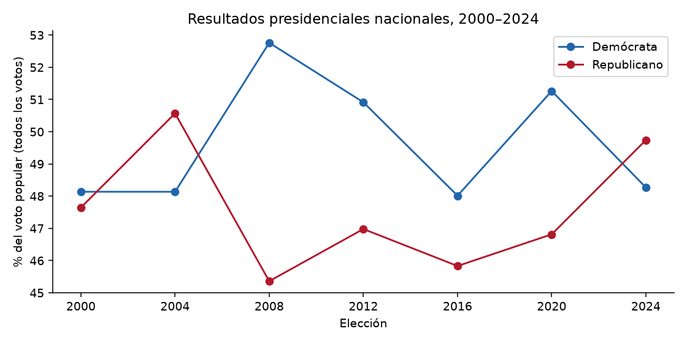
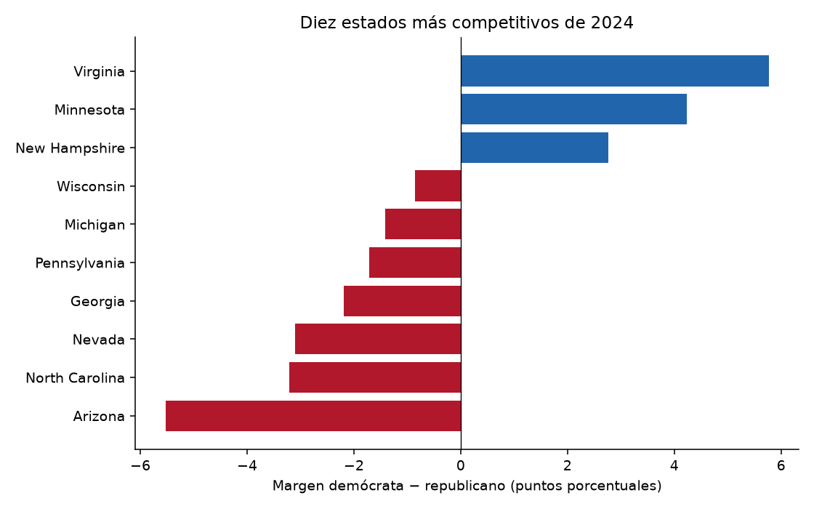
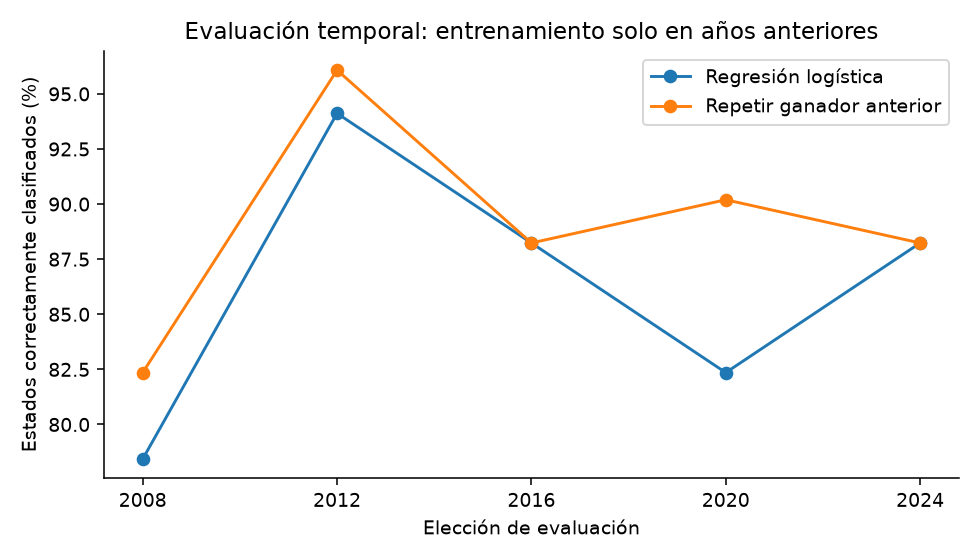

# Informe del trabajo práctico: elecciones presidenciales de Estados Unidos

**Fecha:** 1 de octubre de 2026.
**Repositorio local:** `/workspace/Ciencia-datos-`.
**Estado:** fuentes implementadas descargadas e integradas; análisis histórico ejecutado. Persisten límites de cobertura y de interpretación. Este informe no presenta un pronóstico de 2028.

## 1. Objetivo y pregunta de investigación

El proyecto estudia los resultados presidenciales de Estados Unidos entre 2000 y 2024 y evalúa si el comportamiento electoral previo y las características demográficas de los estados ayudan a anticipar el partido ganador de una elección posterior.

Las preguntas abordadas son:

1. ¿Cómo cambió el voto popular nacional durante el período?
2. ¿Qué estados tuvieron los márgenes más pequeños en 2024?
3. ¿Un modelo basado en resultados anteriores supera la regla de repetir el ganador anterior?
4. ¿Agregar educación, edad y pobreza de Census mejora la predicción fuera del entrenamiento?

La unidad de análisis es **estado y año electoral**, incluyendo al Distrito de Columbia. El ganador estatal se define por el margen de votos demócratas menos republicanos. El voto popular nacional y el ganador de la presidencia son resultados distintos: la presidencia requiere analizar el Colegio Electoral.

## 2. Dónde se guardó la solución

La solución está guardada en el repositorio `diaznicolasandres1/Ciencia-datos-`. El código, los datos y el notebook se publicaron en GitHub; las modificaciones de esta explicación se guardan en el checkout local hasta su siguiente commit.

| Archivo o directorio | Contenido |
|---|---|
| [`build_dataset.py`](build_dataset.py) | Descarga, transformación, unificación y validación del dataset. |
| [`analyze.py`](analyze.py) | Análisis exploratorio, gráficos y evaluaciones temporales de los modelos. |
| [`data/raw/`](data/raw/) | Archivos fuente electorales, encuestas, FRED y Census. |
| [`data/raw/manifest.json`](data/raw/manifest.json) | Inventario de archivos, fuentes y huellas SHA-256. |
| [`data/processed/elections_master.csv`](data/processed/elections_master.csv) | Dataset maestro para Pandas y modelado. |
| [`data/processed/data_quality.json`](data/processed/data_quality.json) | Cobertura, faltantes y limitaciones. |
| [`reports/analisis.md`](reports/analisis.md) | Resumen generado por el script de análisis. |
| [`reports/figures/`](reports/figures/) | Gráficos exportados. |
| [`reports/backtest_metrics.csv`](reports/backtest_metrics.csv) | Métricas del modelo histórico inicial. |
| [`reports/census_model_comparison.csv`](reports/census_model_comparison.csv) | Comparación de modelos sobre la misma muestra con Census. |
| [`reports/census_correlations.csv`](reports/census_correlations.csv) | Correlaciones por elección, sin mezclar todos los años. |
| [`reports/census_summary.csv`](reports/census_summary.csv) | Cantidad de datos, mínimos, medianas y máximos demográficos. |
| [`tests/test_dataset.py`](tests/test_dataset.py) | Pruebas de calidad y de tratamiento temporal. |
| [`README.md`](README.md) | Instalación, ejecución y documentación técnica. |

La clave de Census se utilizó únicamente en los procesos de descarga. No se incluyó en archivos del repositorio ni en configuración persistente. Los JSON guardados contienen los datos solicitados, sin la clave.

## 3. Datos utilizados y preparación

El dataset final tiene **357 filas y 37 columnas**: siete elecciones por 51 jurisdicciones. Se utilizaron las elecciones de 2000, 2004, 2008, 2012, 2016, 2020 y 2024.

| Fuente | Información incorporada | Cobertura y tratamiento |
|---|---|---|
| MIT/MEDSL, histórico mediante mirror de Plotly | Votos y resultados estatales | 2000–2020; también se procesa 1996 para calcular el resultado previo de 2000. |
| MEDSL, resultados oficiales de 2024 | Votos y resultados estatales | 2024, incluyendo DC. |
| FiveThirtyEight, archivo histórico | Estimaciones de intención de voto | 2000–2016; 248 filas con ambos candidatos. No se usa en los modelos por su reconstrucción retrospectiva. |
| FRED | Desempleo, inflación y crecimiento del PIB real | Todas las elecciones; promedios del año anterior. Las series actuales contienen revisiones históricas. |
| Census ACS | Población, edad, ingreso, educación, composición racial/étnica, pobreza y desempleo | 255 filas de 2008–2024. Los 102 registros de 2000/2004 quedan sin estas variables. |

### Qué aporta cada dataset al problema

Los resultados electorales aportan la **respuesta que el modelo debe aprender**: quién ganó cada estado. También permiten construir sus entradas históricas, desplazando cuatro años los porcentajes y márgenes. El resultado de 2024 solo puede usarse como etiqueta al evaluar 2024; como predictor de 2028 podría usarse únicamente bajo una proyección explícita de ese ciclo.

Census aporta el **contexto de cada estado**: educación, edad, pobreza, ingresos y población. Hace comparables características de estados con tamaños diferentes al expresarlas como porcentajes. En el modelo ampliado de esta versión entran educación, edad y pobreza; las demás variables quedan disponibles para descripción y futuros análisis justificados.

FRED aporta el **contexto económico nacional**. Se incorpora al dataset para describir los años electorales, pero no entra en los modelos ejecutados. Al repetirse entre todos los estados de una elección, su información independiente proviene principalmente de los pocos años disponibles, no de 357 observaciones económicas diferentes. No se ha estimado su aporte predictivo.

FiveThirtyEight aporta una medida de **intención de voto próxima a la elección**, diferente del resultado anterior y de la demografía. El archivo actual se utiliza para integrar y explorar datos; se excluye del entrenamiento porque es retrospectivo y tiene cobertura incompleta. No se ha probado si mejora las predicciones.

**Integrar una fuente al CSV no equivale a haber demostrado su utilidad en el modelo.** La comparación realizada mide únicamente el efecto de agregar tres variables de Census a las entradas electorales históricas.

### Qué significa curar la información

Curar la información es conservar su procedencia, verificar su significado, corregir representaciones incompatibles, integrar unidades comparables y dejar documentados los problemas que siguen abiertos. No consiste en eliminar filas hasta que el modelo tenga buenos resultados.

| Problema encontrado | Tratamiento aplicado | Motivo y control |
|---|---|---|
| Varias filas por candidato o línea partidaria | Sumar votos por partido, estado y año | Recuperar el resultado estatal; verificar que votos D + R no superen el total. |
| TOTAL junto con modos desagregados, si aparecen | Preferir TOTAL dentro de cada estado y año | Evitar duplicar votos; caso cubierto por una prueba, sin afirmar que ocurrió en todos los archivos. |
| Identificadores con formatos diferentes | FIPS de dos caracteres y abreviaturas normalizadas; nombres completos para presentación | Unir estados por identidad, sin depender de cómo se escribe su nombre. |
| Fuentes con frecuencias distintas | Encuestas hasta octubre, ACS anterior y economía del año previo | Comparar información referida a una misma elección sin incluir períodos posteriores. |
| Tablas antiguas de Census incompatibles con códigos modernos | Consultar tablas equivalentes y sumar categorías civiles/educativas correspondientes | Mantener las definiciones de las variables entre años. |
| Códigos negativos especiales de Census | Convertirlos a faltantes | Evitar interpretar valores especiales como población o porcentajes reales. |
| Demografía ausente para 2000/2004 | Mantener 102 filas sin esas variables | No inventar datos; restringir la comparación con Census a los años con cobertura. |
| Población hispana con códigos especiales en 2008 | Mantener 13 faltantes adicionales | La variable tiene 115 faltantes en total y no se usa en el modelo. |
| Encuestas faltantes | Mantener 109 valores faltantes, sin reemplazarlos por cero | Cero indicaría ausencia de apoyo, no ausencia de medición. |
| Riesgo de duplicar filas al unir | Validar joins uno-a-uno o muchos-a-uno | Mantener exactamente 357 observaciones estatales únicas. |
| Riesgo de perder procedencia | Preservar originales y registrar URL, tamaño y SHA-256 | Poder verificar y reconstruir lo procesado. |

No se imputaron medias, no se eliminaron valores extremos ni se ajustó el ingreso por inflación en esta versión. Los faltantes quedan explícitos y los modelos utilizan únicamente columnas disponibles. Los checks de porcentajes, cardinalidad y rezagos no sustituyen revisar fechas de publicación, equivalencia estadística y calidad de cada fuente.

### Qué relaciones se establecen al integrar

Hay que distinguir tres relaciones:

1. **Relación de identidad:** el resultado electoral y Census describen el mismo estado. La unión usa FIPS, no una correlación entre variables.
2. **Relación temporal:** los atributos se asignan a la elección correspondiente con un año de referencia explícito. El resultado previo se calcula dentro de cada estado, nunca desplazando filas de distintos estados.
3. **Relación estadística:** después de integrar, se estudia si educación, ingresos o historial electoral se asocian con el margen o el ganador. Estas asociaciones son estimaciones; no son la condición que permite unir las tablas ni prueban causalidad.

Por ejemplo, una fila de Pennsylvania para 2024 combina su resultado observado de 2024, el resultado previo de 2020, ACS de referencia 2022, economía nacional de 2023 y encuestas faltantes para ese ciclo. El modelo histórico solo recibe los atributos de 2020; el ampliado agrega educación, edad y pobreza de ACS. El resultado de 2024 se reserva para comprobar la predicción.

### Limpieza y unificación

- Se sumaron las líneas partidarias de votos demócratas y republicanos. Para 2024 se evitó sumar registros TOTAL junto con modos desagregados.
- Los porcentajes electorales usan el total oficial, incluyendo votos a terceros candidatos. Por eso los porcentajes demócrata y republicano no necesariamente suman 100%.
- Se normalizaron códigos FIPS como texto de dos dígitos y abreviaturas estatales. Los joins se validan para impedir duplicación de filas.
- Census se une por año electoral y FIPS estatal; las encuestas por año y abreviatura estatal; FRED por año electoral.
- Se crearon rezagos por estado: porcentajes, margen y ganador de la elección inmediatamente anterior.
- Los códigos negativos especiales de Census se convierten en valores faltantes, no en valores demográficos reales.
- Educación se define como porcentaje de personas de 25 años o más con grado universitario de bachelor o superior. Pobreza y desempleo usan sus respectivos universos estadísticos.

### Referencias temporales de Census

| Elección | Año de referencia ACS | Producto |
|---|---:|---|
| 2008 | 2006 | ACS 1-year |
| 2012 | 2010 | ACS 5-year |
| 2016 | 2014 | ACS 5-year |
| 2020 | 2018 | ACS 5-year |
| 2024 | 2022 | ACS 5-year |

Se usan años anteriores a la elección para reducir el riesgo de introducir información posterior. Un ACS 5-year resume cinco años, no una medición puntual de su último año. Para 2006 y 2010 fue necesario utilizar tablas antiguas equivalentes: B15002 para educación, B23001 para sumar empleo y desempleo civil, y B03001 para población hispana. Desde 2014 se utilizan las tablas más recientes. La equivalencia de definiciones y las fechas de publicación deben documentarse en la entrega final.

## 4. Análisis exploratorio y resultados

### 4.1 Voto popular nacional

Se sumaron los votos estatales antes de calcular los porcentajes nacionales. No se promediaron porcentajes de estados con poblaciones diferentes.

| Elección | Demócrata % | Republicano % | Margen D−R, puntos porcentuales |
|---|---:|---:|---:|
| 2000 | 48,14 | 47,65 | +0,49 |
| 2004 | 48,14 | 50,57 | −2,43 |
| 2008 | 52,76 | 45,36 | +7,40 |
| 2012 | 50,92 | 46,98 | +3,94 |
| 2016 | 48,01 | 45,83 | +2,18 |
| 2020 | 51,26 | 46,82 | +4,45 |
| 2024 | 48,27 | 49,74 | −1,47 |

El margen demócrata nacional fue positivo en cinco de las siete elecciones. Esto describe el voto popular y no equivale a contar presidencias ganadas.



### 4.2 Estados competitivos en 2024

Los cinco menores márgenes absolutos fueron Wisconsin (−0,86 pp), Michigan (−1,41 pp), Pennsylvania (−1,71 pp), Georgia (−2,19 pp) y New Hampshire (+2,76 pp). Los primeros cuatro tuvieron ganador republicano; New Hampshire tuvo ganador demócrata.

Esta selección utiliza resultados conocidos de 2024 y sirve para describir esa elección. Para evaluar una predicción real, la selección de estados competitivos tendría que hacerse con información anterior a la elección.



### 4.3 Demografía y margen electoral

Se calcularon correlaciones de Pearson entre características estatales y margen demócrata, separando cada elección. Para 2024 se utilizaron los datos ACS de referencia 2022 y las 51 jurisdicciones.

| Variable | Correlación con el margen demócrata de 2024 |
|---|---:|
| Educación universitaria | +0,844 |
| Ingreso mediano del hogar | +0,720 |
| Desempleo ACS | +0,369 |
| Edad mediana | +0,139 |
| Pobreza | −0,295 |

En este corte, los estados con mayor educación universitaria e ingreso mediano tendieron a registrar márgenes demócratas más altos. **Estas asociaciones no prueban causalidad ni describen directamente el voto de cada persona.** Las variables pueden estar relacionadas entre sí; DC también puede influir en los resultados por sus características particulares. Las correlaciones deberían contrastarse con gráficos, otras elecciones y un análisis de sensibilidad sin DC.

## 5. Modelado y evaluación temporal

### Cómo aprende el modelo y cómo genera una previsión

Se utiliza **aprendizaje supervisado**: cada fila de entrenamiento tiene entradas conocidas (`X`) y una respuesta observada (`y`). En esta implementación, `y = 1` indica ganador demócrata y `y = 0` ganador republicano. No se predice el nombre del candidato ni el porcentaje de votos: se estima la probabilidad del partido ganador de cada estado.

El entrenamiento sigue estos pasos:

1. Seleccionar solo elecciones anteriores a la que se evaluará. Para evaluar 2024, el modelo histórico usa 306 filas de 2000–2020; el ampliado usa 204 filas con ACS de 2008–2020.
2. Construir `X` con los porcentajes y márgenes de la elección previa, agregando tres variables ACS en el modelo ampliado. Construir `y` con los ganadores observados de esos años de entrenamiento.
3. Ajustar `StandardScaler` sobre `X` de entrenamiento: aprende una media y una desviación para cada columna. Los datos de evaluación se transforman con esos mismos valores, sin volver a ajustar el escalado.
4. Ajustar una regresión logística regularizada (`C=1.0`). El algoritmo busca coeficientes que reduzcan el error de las probabilidades respecto de las etiquetas conocidas, penalizando coeficientes excesivos. `max_iter=1000` es un límite de iteraciones de optimización, no una cantidad de elecciones ni de ejemplos.
5. Aplicar el pipeline entrenado a las entradas de los estados del año evaluado. `predict_proba` produce `P(ganador demócrata)`; su complemento es la probabilidad republicana en esta clasificación binaria.
6. Con el umbral actual de 0,5, clasificar como demócrata si la probabilidad es al menos 0,5; de lo contrario, como republicano. Comparar después con el resultado real mediante accuracy, Brier y log loss.
7. Repetir el proceso con una ventana creciente de elecciones: cada evaluación vuelve a entrenar usando únicamente su pasado.

Conceptualmente, la regresión calcula una puntuación `z = intercepto + suma(coeficiente × variable estandarizada)` y la convierte en `p = 1 / (1 + exp(−z))`. Los coeficientes se aprenden de los ejemplos; no son pesos asignados manualmente a cada estado. Su signo no demuestra causalidad y puede verse afectado por variables correlacionadas.

Los hiperparámetros y el umbral se mantuvieron fijos; no se buscaron combinaciones que optimizaran los resultados de 2024. Tampoco se realizó una selección de variables exhaustiva ni se validó la calibración para un pronóstico futuro.

**Qué previsión se ha probado:** reconstruir predicciones de elecciones históricas, entrenando solo con años anteriores. **Qué falta para una previsión futura:** construir entradas disponibles para ese ciclo, justificar los supuestos, comprobar estabilidad y calibración, y establecer cómo las probabilidades estatales se traducen al Colegio Electoral. Entrenar con todos los datos y evaluar sobre esas mismas filas no demostraría capacidad de prever una nueva elección.

### 5.1 Modelo inicial basado en elecciones anteriores

Se entrenó una regresión logística con `previous_margin` y `previous_dem_pct`. Las variables se estandarizan dentro del pipeline utilizando únicamente los datos de entrenamiento. El resultado a predecir es `target_democrat`: 1 para ganador demócrata y 0 para ganador republicano.

Para cada elección evaluada se entrenó exclusivamente con elecciones anteriores. La referencia de comparación consiste en repetir el ganador estatal de la elección previa. No se usaron los resultados actuales como entradas ni se realizó una partición aleatoria de estados.

| Evaluación | Entrenamiento, filas | Aciertos del modelo | Accuracy del modelo | Accuracy de repetir ganador previo |
|---|---:|---:|---:|---:|
| 2008 | 102 | 40/51 | 78,43% | 82,35% |
| 2012 | 153 | 48/51 | 94,12% | 96,08% |
| 2016 | 204 | 45/51 | 88,24% | 88,24% |
| 2020 | 255 | 42/51 | 82,35% | 90,20% |
| 2024 | 306 | 45/51 | 88,24% | 88,24% |

En conjunto, el modelo acertó **220 de 255 casos (86,27%)**, frente a **227 de 255 (89,02%)** de la regla simple. Por lo tanto, el modelo inicial no demostró una mejora sobre esa referencia.



### 5.2 ¿Qué cambió al incorporar Census?

Se compararon dos regresiones logísticas sobre **las mismas filas y los mismos años de entrenamiento**, disponibles desde 2008:

- Modelo histórico: margen y porcentaje demócrata de la elección anterior.
- Modelo ampliado: las mismas entradas más educación universitaria, edad mediana y pobreza.

Se evaluaron 2016, 2020 y 2024 para disponer de al menos dos elecciones previas con ACS. Esta comparación no debe confundirse con el primer backtest, que usa más años de entrenamiento.

| Evaluación | Entrenamiento, filas | Histórico: aciertos | Con Census: aciertos | Accuracy histórico | Accuracy con Census | Brier histórico | Brier con Census |
|---|---:|---:|---:|---:|---:|---:|---:|
| 2016 | 102 | 44/51 | 44/51 | 86,27% | 86,27% | 0,106 | 0,091 |
| 2020 | 153 | 43/51 | 46/51 | 84,31% | 90,20% | 0,072 | 0,071 |
| 2024 | 204 | 44/51 | 41/51 | 86,27% | 80,39% | 0,075 | 0,124 |

El modelo ampliado ganó tres aciertos en 2020 y perdió tres en 2024; en total, ambos modelos acertaron **131 de 153 casos (85,62%)**. El Brier score, que mide el error de las probabilidades y es mejor cuanto menor sea, mejoró en 2016 y 2020 y empeoró en 2024.

**Resultado:** agregar Census no produjo una mejora estable de la clasificación ni de las probabilidades. Una asociación demográfica fuerte en el análisis descriptivo no garantiza mayor capacidad predictiva en una elección posterior. Tampoco permite afirmar que toda información demográfica sea inútil: solo se probó esta especificación sencilla, con pocas elecciones.

## 6. Qué revisar para cerrar el trabajo práctico

| Revisión | Situación actual y siguiente acción |
|---|---|
| Consigna y rúbrica | Contrastar el proyecto con los métodos, gráficos y formato exigidos por la cátedra; la consigna formal no está en el repositorio. |
| Cobertura y joins | Hay 357 filas únicas y 255 con ACS. Revisar los 102 faltantes históricos y no convertirlos en ceros. |
| Comparabilidad de Census | Documentar ACS 1-year frente a 5-year, cambios de tablas, universos y fechas de publicación. Incorporar márgenes de error si la consigna pide incertidumbre de las estimaciones. |
| Ingresos | Se presentan valores nominales. Ajustar por inflación antes de comparar ingreso entre años o usarlo en modelos temporales. |
| Disponibilidad temporal | Confirmar fechas de publicación de ACS y recuperar vintages de FRED si se afirma un backtest de información disponible en tiempo real. |
| Exploración demográfica | Revisar distribuciones, valores atípicos, correlaciones entre predictores y sensibilidad a DC. No interpretar correlaciones como causas. |
| Comparación de modelos | Mantener idénticas muestras, cortes temporales y métricas; cualquier ajuste de hiperparámetros debe usar únicamente elecciones anteriores a la evaluación. |
| Estados competitivos | Evaluar aparte un subconjunto definido con información preelectoral. La accuracy general puede estar dominada por estados seguros. |
| Probabilidades | Revisar Brier, log loss y calibración; no asumir que la salida de la regresión es una probabilidad presidencial validada. |
| Encuestas | Faltan 2020/2024 y hay siete filas adicionales sin estimaciones en 2000–2016. El archivo retrospectivo existente no se incorporó al backtest. |
| Colegio Electoral | Faltan asignaciones históricas verificadas y resultados distritales de Maine/Nebraska. Sin esto, el trabajo predice ganadores estatales, no la presidencia. |
| Proyección 2028 | Requiere datos y supuestos de ese ciclo, además de incertidumbre y errores correlacionados entre estados. No está implementada. |

## 7. Reproducibilidad y controles

Desde el entorno preparado, los datos descargados pueden reutilizarse sin volver a proporcionar la clave:

```bash
cd /workspace/Ciencia-datos-
source /workspace/.venvs/ciencia-datos/bin/activate
python build_dataset.py --offline
python analyze.py
python -m pytest -q
```

Los controles verifican agregación de votos, rezagos por estado, cardinalidad del panel, denominadores y códigos especiales de Census, uso del año económico anterior y ausencia de los resultados actuales entre los predictores. Las pruebas automatizadas no sustituyen revisar la metodología estadística.

`reports/analisis.md` y los CSV de resultados se regeneran al ejecutar el análisis. Este informe es una explicación de los resultados de esta versión: debe actualizarse si cambian los datos o los modelos.

## 8. Conclusión

Se construyó un pipeline reproducible y un panel estatal de siete elecciones, con resultados electorales, economía, encuestas históricas y demografía disponible desde 2008. El análisis identificó la evolución del voto popular, los estados más competitivos de 2024 y asociaciones demográficas relevantes.

El modelo histórico no superó la regla de repetir el ganador anterior. La incorporación de Census tampoco produjo una mejora consistente: mejoró 2020 y empeoró 2024. Ese resultado es una conclusión válida del trabajo, no un motivo para ocultar evaluaciones desfavorables.

La solución permite desarrollar un trabajo práctico de integración de datos, exploración y evaluación temporal. Para afirmar que predice el próximo presidente todavía se necesitan completar el análisis del Colegio Electoral, justificar la información disponible en cada fecha y validar la incertidumbre.
